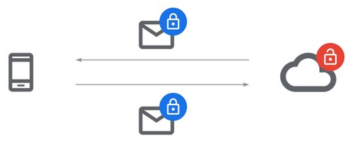
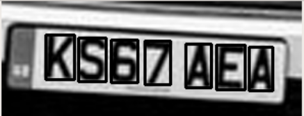
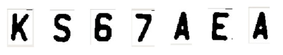
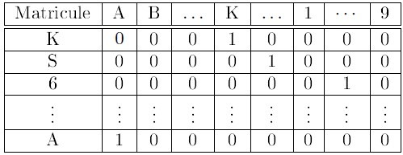
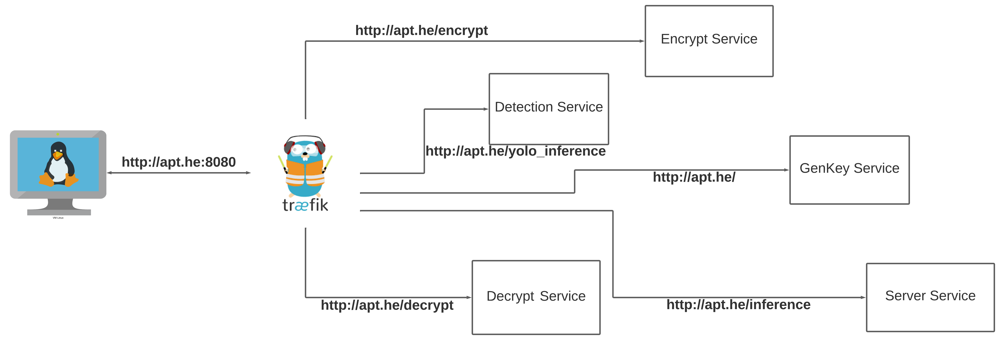

<h1 align="center">
   
  
   
  Actemium Paris Transport
   
</h1>

<h2 align="center">
   
  Speed Computation using HE 
   
</h2>

This document aims to describe the project where we propose an industrial application of Homomorphic Encryption. We start with an introduction and motivation for this project in the section 1.  Since this work aims to compute the vehicle speed using registration number and passing time, snapshotted from a camera.Therefore, the section 2 presents the detection and extraction of a registration plate from an image using Yolov4 and Tesseract OCR. We show in section 3, the scientific obstacles we faced in order to perform comparison between encrypted data, and how we overcame them. The encryption procedure of the registration number and passing time is presented in the section 4. The section 5 contains the presentation of our architecture.  Finally, the section 6 gives a conclusion to our project.
  

# Table of Contents
1. [Introduction](#Intro)
2. [Detection and Extration of Registration Plate Number](#DetectExtract)
3. [Scientific Obstacles](#SO)
4. [Encryption Procedure](#EncProcess)
5. [Client-Server Architecture](#CSArch)
6. [Conclusion](#Conc)

<h1 name="Intro" align="center">Introduction</h1>

The topics of security and data have become almost inseparable as enterprises move more workloads to the cloud. But unlocking new uses for that data, particularly driving richer AI and machine learning, will require next-generation security. To that end, companies have been developing confidential computing to allow data to remain encrypted while it is being processed. But as a complement to that, a security process known as fully homomorphic encryption is now on the verge of making its way out of the labs and into the hands of early adopters after a long gestation period.

Present techniques to secure data, consists mainly in trusting the server owner. Since the server needs the secret key to decrypt the data, in order to perform the necessary computations, then encrypt the result and send back the result to the client. As depicted in the following figure. This maneuver is fallible since the server owner have access to the plain data. In that way, HE is a game changer since it permits the server owner to perform the necessary computations without having access to the plain data. Therefore, the client does not need to send the secret key among the encrypted message, which makes it even more secure. As a consequence, if the encrypted message is retrieved by a hacker, it will remain secure. Because without the secret key, there is no way to retrieve the original message.

Actemium Paris Transport is in charge of the maintenance of several highways in Île-de-France. Therefore, there clients have access to nearly 26000 cameras. Our goal is that APT can offer a service to its clients while having access only to an encrypted version of the data. The idea of this project is to compute the speed of a vehicle, firstly by comparing the registrations numbers captured by two cameras, and then computing the speed knowing the passing time of the vehicle and the distance between the two cameras. Since we are dealing with sensitive data such as registration number, which contains many personal informations. The use of HE in this case came by itself.

<h1 name="DetectExtract" align="center">Detection and Extration of Registration Plate Number</h1>

Our aim is to know if we are dealing with the same vehicle from two images. Therefore, we can compare them using the registration plate number. In order to use this feature, we have to detect it first, and then extract it as a string so the machine can compare it with another registration plate number. Which is the main content of this section.

First of all, we downloaded a pre-trained model of the Yolov4, and we performed a fine tuning with a registration plate dataset, available at [Kaggle](https://www.kaggle.com/datasets/andrewmvd/car-plate-detection) composed of $433$ images with their annotations, we would have split them into $80$ % for the training part and $20$ % for the testing part. 
Once we had the detection with the corresponding bounding boxes of the registration plate. We went into some preprocessing steps as follow : 

0. The following image show the car before any detection :

1. We took the subimage region that contains the registration plate, thank's to the detection made by the Yolov4 model. Since this new image is so little, we used *cv2.resize()* to increase the image's size by three times.

2. In order to smooth out the image, we convert it to grayscale and use a slight Gaussian blur.

3. The image is then thresholded to have white lettering on a black back-drop, using the Otsu's filtre. This white writing on a black background makes it easier to see an image's contours. As shown in the following image. 

4. The image is then dilated using opencv in order to make contours more visible and be picked up in futur steps.

5. Next we use opencv to find all the rectangular shaped contours on the image and sort them left to right. As shown in the following image.

6. The selection of those contours are choosen by fulfilling some criteria, like the ratio of height and width. Those criteria are robust, because the size of registration numbers character are normalized among the EU area.

7. All that remains of the regions of interest are the individual characters on the registration plate number. This finale image is given to Tesseract OCR in order to extract the letter or number in the final stage. The following figure shows the final image given to Tesseract OCR.

The final result shows the registration plate number extracted as a string. The code for the extraction procedure is available [here](https://github.com/Actemium-Paris-Transport/SpeedComputation/blob/f165cf036734c16fdf1a112fd19956634b2d1ade/Yolo/core/utils.py#L19)

<h1 name="SO" align="center">Scientific Obstacles</h1>

Our main objective is to compute the speed vehicle from two images snapshotted from two different cameras. But, in order to preserve the privacy of the drivers, we want to do this comparison using only encrypted data.  Our first attempt was to encrypt naively the extracted registration plate from two distinct images, but we faced a major issue. In fact, comparison between two encrypted data is not possible in HE. To be more precise, we cannot use comparison operations like < or > between two ciphertext. Simply because, we cannot extract any information from an encrypted data. Therefore, we cannot know if a ciphertext C1 is equal, greater or smaller than a ciphertext C2. This kind of operations needs the secret key to be performed. Hence, revealing the registration plate number to the server, in our case. 

<h1 name="EncProcess" align="center">Encryption Procedure</h1>

Since, there is a finite number of combinations for the registration plate number, 36 characters to be more precise (26 alphabets and 10 numbers). We encoded each character using the One-Hot-Encoding as depicted in the following figure.

Following this figure, each character will be a vector having $1$ for the occurrence of the character and $0$ elsewhere. 

Let’s take a short example for this procedure : 

$$v_1 = [0 , 1 , 0 , 0 , 0 , ... , 0] \space \space , v_2 = [0 , 1 , 0 , 0 ,0 , ... , 0]$$
if we perform $v_1 \times v_2$ ,taking into account that $size(v_1)=size(v_2)$ we would have : 

$$v_3 = v_1 \times v_2 = [ 0, 1 , 0 , 0 , 0 , ... , 0]$$

Now, if we sum up each character of $v_3$ :

$$\sum v_i = 1$$

Since, the Sum of each element of the multiplication is $1$ , we can conclude that $v_1 = v_2$ . On the other hand, if this Sum was $0$ we could say that $v_1 \neq v_2$ . Therefore, we are using only multiplications and additions, we can apply the same procedure for encrypted vectors. And by repeating those procedure for each character, we can perform a comparison between two encrypted data.  

Please note, that even if we performed homomorphic comparison using the One-Hot-Encoding, we are not able to know if the result is 1 (same registration plate) or 0 (different registration plate) as long as it is encrypted. Having this information in mind, we compute the speed vehicle using encrypted version of the passing time snapshotted by the cameras, and the distance between those two latter. So the final result would be $FinalResult = ResultComparison \times EncryptedSpeed$ . We will have two distinct scenario when decrypting this final result : 
- $FinalResult = 0 \Longrightarrow ResultComparison = 0 \Longrightarrow$ Not the same registration plate $\Longrightarrow$ Not the same car.
-  $FinalResult = Speed \Longrightarrow ResultComparison = 1 \Longrightarrow$ The same registration plate $\Longrightarrow$ The same car.

<h1 name="CSArch" align="center">Client-Server Architecture</h1>

In order to deliver a demonstration of this application, we made up Different back-end API using FastAPI, in order to separate our work in different services.
The following text shows the functionality of each API :

* **Client API** : 
1. *Key Generation* : which accepts only GET request and return us a JSON file containing two data : 1) *public context* which is a TenSEAL object containing the *public, evaluation* and *relineariazation key* . Those three keys can be shared with other users, 2) a *secret key* which have to be kept secret by the user and **must not** be shared.

2. *Encrypt* : accepts only POST request containing several data in a JSON file mainly, *public context , registration numbers, passing times* and return a JSON file containing : encrypted version of the *registration number* and *passing time*

3. *Decrypt* : accepts only POST request containing several data in a JSON file mainly, *secret key* ,and the encrypted version of the *vehicle speed*. Return us, the *vehicle speed*

* **Server API** : 

1. *Inference* : accepts only POST request containing data in a JSON file which are : the encrypted version of *registration number* , *passing time* , *public context*

* **Yolo API** : In a real industrial project, this API should be embedded  in a module and connected to the camera.

1. *Yolo_inference* : Accepts only POST requests, containing the image of the vehicle. Return us a JSON file containing the registration number and the passing time.

Since we deployed our work using several micro-services using docker, we added a reverse-proxy named *Traefik* which is famous among the docker community. In fact, the reverse-proxy will be the only entity to communicate with the user. In the other hand the user cannot access to a particular service without passing by the reverse-proxy. This architecture is depicted in the following figure.

<h1 name="Conc" align="center">Conclusion</h1>

We presented a viable application using Homomorphic encryption with accordance to Actemium Paris Transport activities. We used a deep learning model in order to detect and extract registration number from an image snapshotted by a camera. We faced a scientific issue, which was the comparison between two encrypted data. Issue that we fixed by re-thinking the comparison and using the One-Hot-Encoding algorithm. Finally, we deployed a demonstration using micro-services and reverse-proxy.