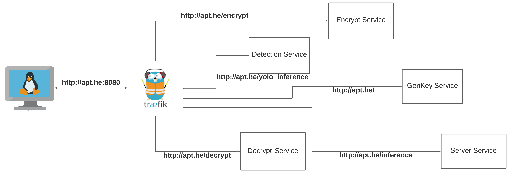

<h1 align="center">
  <br>
  <a href="https://www.actemium.fr/entreprise/actemium-paris-transport//"></a>
  <br>
  Actemium Paris Transport
  <br>
</h1>

<h2 align="center">
  <br>
  Speed Computation using HE 
  <br>
</h2>

<br><br><br><br>

# Table of Contents
0. [Introduction](#def)
1. [Detection and Extraction of the Registration Plate](#Detect)
2. [Encryption Procedure](#Enc)
3. [Architecture of Process](#Arch)
4. [Run](#build)
5. [Conclusion](#conc)
<br><br><br><br> 


# Introduction <a name="def"></a>

Actemium Paris Transport is in charge of the maintenance of several highways in Île-de-France. Therefore, there clients have access to nearly 26000 cameras. Our goal is that APT can offer a service to its client while having access only to an encrypted version of the data. 
The main idea of this project is to compute the speed of a vehicle by :

1. Comparing the registration numbers captured by two cameras.
2. Computing speed using the encryption version of the vehicles passing time and the distance between the two cameras.
<br><br><br><br> 

# Detection and Extraction of the Registration Plate <a name="Detect"></a>
In order to compare the registration plates, we have to detect them using YOLOv4 model. This latter, was fine tuned using a database composed of 500 images of registration plate. Please note that our model was configurated in order to detect only registration plate.

After detecting the registration plate we go through some preprocessing in order to give the segmented characters of the registration plate to Tesseract OCR. This latter is a module that we used in order to convert an image into a string. 

<br><br><br><br> 

# Encryption Procedure <a name="Enc"></a>
Comparison operations are not possible using encrypted data, let clarify this point using an example : 

$m_1$ and $m_2$ are two  plain numbers and let $c_1$ and $c_2$ their encryption version : 
$$c_1 = Enc(m_1)$$
$$c_2 = Enc(m_2)$$

Operations like $c_1 \space < \space c_2$ or $c_1 \space > \space c_2$ or even checking equality are not possible due to the nature of encryption. Hence, simply sending encryption version of our registration numbers, would be useless. Therefore, we had to re-think the comparison. 

- Apply the one-hot-ecoding to each character of the registration number. This method is possible because we have a finite number of combinations (26 for alphabets and 10 for numbers).The following table shows how we used the One-Hot-Encoding
- Multiply each charachter with it corresponding one. 
- Sum the result of each multiplication.
- Multiply the last result 

Finally, if we end up with $1$ means that we have the same registration number. On the hand, if  the result is $0$ means that the registration numbers are different.
<br><br><br>

# Architecture of Process <a name="Arch"></a>

In orde to deliver a pre-industrialize product of our application, we build up different stateless API using FastAPI separating our work into different services. The following text shows the functionality of each API :

<br>

- Key generation API $(Client \space Part)$ : Contains only one endpoint, which accepts only GET requests and return us a JSON file containing : 1) $public \space context$ : an object containing the $public, \space evaluation$ and $relinearization \space key$. 2) the $secret \space key$ which have to be kept secret by the user and can not be shared.

<br>

- Detection & Extraction API $(Client \space Part)$ : Which take as input two distinct images in order to detect the registration plate and then extract the registration number and return us a JSON file containing the registration number of each image as a string.

<br>

- Encrypt API $(Client \space Part)$ : Contains a single endpoint which accepts POST request and receives a JSON file containing the $public \space context$ , registration number and passing time. This latter, will send back a JSON file containing encrypted version of both registration numbers and passing time.


<br>

- Server API $(Server \space Part)$ Which accepts POST requests containing encrypted data (registration number, passing time) in order to perform speed computation and comparison of registration numbers. This latter,return us an encrypted result. Result that will be sent to the Decrypt API.


<br>

- Decrypt API $(Client \space Part)$ : Contains a single endpoint which accepts POST requests containing the $secret \space key$ and the result of the speed computation received from the Server API. This latter, return us the speed of the vehicle in plain.


In addition to thoses services, we implemented a reverse-proxy \ load balancer named $Traefik$ which is famous among the docker community.



<br><br><br><br> 

# Run <a name="build"></a>

- The first step is to pull the docker images : 

```python
docker pull hb.factory.showroom.aixom.tech/general/genkey:v1.5
 ```

```python
docker pull hb.factory.showroom.aixom.tech/general/encrypt:v1.5
 ```

```python
docker pull hb.factory.showroom.aixom.tech/general/decrypt:v1.5
 ```

```python
docker pull hb.factory.showroom.aixom.tech/general/server:v1.5
 ```


```python
docker pull hb.factory.showroom.aixom.tech/general/yolo:v1.5
 ```

- Once you have all the images you will need to change the Domain name as pointed in the figure below:
```
$ sudo vim /etc/hosts
 ```


- Next, you will have to run the docker-compose file:

```python
docker-compose up
 ```

- Once all the service are up, the welcome page is located in :

```
http://apt.he/
 ```
Where you should find the following figure


<br><br><br><br> 

# Conclusion <a name="conc"></a>

In conclusion, we showed and deployed an example where HE is used into an industrial project. In fact, the computation of the vehicle speed was done using encrypted passing time and the distance between two cameras. In addition to that, we performed comparison of encrypted registration numbers, thanks to the One-Hot-Encoding since 
